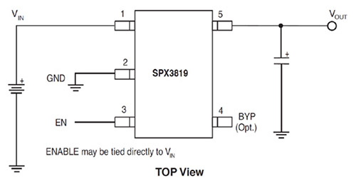
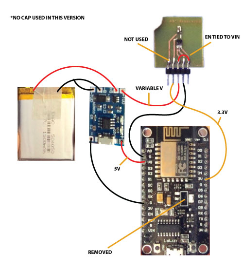

# PCB
We're trying to figure out how to supply the Node with efficient battery
power. It seems inefficient to start with a 3.7V LiPo, boost it to 5V, then
pull it back down to 3.3V via the onboard regulator. There's got to be a better way!

### Proposal
1. Remove the Node's 3.3V regulator.
2. Connect the LiPo charger board inputs (5V and Gnd) to the appropriate Node pins. Some Nodes have a VU pin to make this easy, some don't.
2. Connect 3.7V LiPo > [battery recharger/protection board](https://www.aliexpress.com/item/10PCS-MINI-USB-1A-Lithium-Battery-Charging-Board-Charger-Module-With-Protection-TP4056/32805383965.html?ws_ab_test=searchweb0_0%252Csearchweb201602_4_10152_10065_10151_10130_10068_10344_10345_10342_10343_10340_10341_10541_10540_10307_10060_10155_10154_10056_10055_10054_10539_10538_10537_10059_10536_10534_10533_100031_10099_10103_10102_5590020_10052_5640020_10053_10107_10050_10142_10051_10324_10325_10084_10083_5370020_10080_10082_10081_10178_10110_10111_10112_10113_10114_5630020_10312_10313_10314_10317_10318_10078_10079_10073-10318normal&dp=7d0b428d037493ecac89750e575eb972&af=240682&cv=47843&afref=https%253A%252F%252Ftinyurl.com%252Fcreate.php%253Fsource%253Dindexpage%2526url%253Dhttps%25253A%25252F%25252Fwww.aliexpress.com%25252Fitem%25252F10PCS-MINI-USB-1A-Lithium-Battery-Charging-Board-Charger-Module-With-Protection-TP4056%25252F32805383965.html%25253Fws_ab_test%25253Dsearchweb0_0%25252Csearchweb201602_4_10152_10065_10151_10130_10068_10344_10345_10342_10343_10340_10341_10541_10540_10307_10060_10155_10154_10056_10055_10054_10539_10538_10537_10059_10536_10534_10533_100031_10099_10103_10102_5590020_10052_5640020_10053_10107_10050_10142_10051_10324_10325_10084_10083_5370020_10080_10082_10081_10178_10110_10111_10112_10113_10114_5630020_10312_10313_10314_10317_10318_10078_10079_10073-10318normal%252523cfs%25252Csearchweb201603_25%25252CppcSwitch_5%252526btsid%25253Df94d43b7-f423-41f8-83ac-27b28ef9341d%252526algo_expid%25253D7730b822-e17d-4589-93ef-2c0607a3ed26-7%252526algo_pvid%25253D7730b822-e17d-4589-93ef-2c0607a3ed26%2526submit%253DMake%252BTinyURL%252521%2526alias%253D&mall_affr=pr3&aff_platform=aaf&cpt=1511991300514&sk=VnYZvQVf&aff_trace_key=4e10832e53bf49ab98bbd48d91d23792-1511991300514-04131-VnYZvQVf&terminal_id=2ec559be078d4ece8f4b7b000ec61859) > buck/boost > Node 3.3V pin.
3. The above circuit should account for the variable voltage range the battery will supply.
5. It should also allow you to plug into the Node via USB and still charge the battery.

### Tiny Ass Regulator #1
This breakout was designed around the correct package but the wrong
pinout. AFAIK, you can leave off the caps entirely and still get good
performance. I tested the setup with USB plugged in, then uploaded the
HelloServer demo file so that I could verify the circuit was working
without serial feedback.
 
### Design #2
[Here](http://www.mouser.com/ds/2/308/MC34063A-D-77978.pdf) is a part
that comes in dip form. May be overkill, but similar price and not too
many required components. Another potential issue: the battery charge board will cut out at 2.5V, but this chip only works with inputs down to 3V.